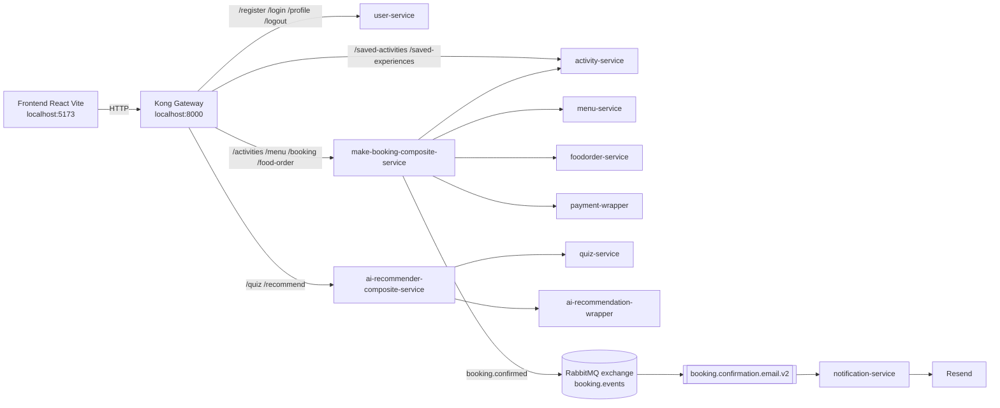

# IS213 Art Studio Cafe Booking Microservice

Art Studio Cafe is a microservice-based booking platform for browsing activities, ordering food, completing a recommendation quiz, and making bookings through a single frontend.

The stack is split into:

- React + Vite frontend
- FastAPI backend services
- Kong as the API gateway
- RabbitMQ for asynchronous events
- Postgres with one database per stateful service
- Resend for booking confirmation email delivery

## Architecture Overview

### High-Level Request Flow

```text
Frontend (React @ :5173)
                |
                v
Kong Gateway (@ :8000)
                |
                +--> user-service
                +--> make-booking-composite-service
                +--> activity-service
                +--> ai-recommender-composite-service

make-booking-composite-service orchestrates:
        - activity-service
        - menu-service
        - foodorder-service
        - payment-wrapper
        - RabbitMQ

ai-recommender-composite-service orchestrates:
        - quiz-service
        - ai-recommendation-wrapper

notification-service consumes booking confirmation events from RabbitMQ
and sends emails through Resend.
```

### Mermaid Diagram



## Service Map

### Frontend

- `frontend/app`
- React 19 + Vite
- Calls Kong at `http://localhost:8000`

### Gateway and Composite Services

- `backend/kong`
    - Declarative Kong config
    - Public entrypoint for frontend traffic

- `backend/composite-service/make-booking-composite-service`
    - Orchestrates booking creation
    - Validates activity slot availability
    - Validates menu items and creates food orders
    - Calls payment wrapper
    - Persists booking through activity-service
    - Publishes booking confirmation events

- `backend/composite-service/ai-recommender-composite-service`
    - Orchestrates recommendation flow
    - Reads quiz submissions and AI recommendation output

### Core Domain Services

- `backend/services/user-service`
    - Registration, login, logout, profile
    - Uses its own Postgres database

- `backend/services/activity-service`
    - Activities catalog
    - Bookings
    - Slot availability checks
    - Saved activities and saved experiences
    - Uses its own Postgres database

- `backend/services/menu-service`
    - Menu catalog and pricing
    - Uses its own Postgres database

- `backend/services/foodOrder-service`
    - Food order persistence
    - Uses its own Postgres database

- `backend/services/quiz-service`
    - Serves quiz question bank
    - Persists quiz submissions
    - Publishes quiz submission events
    - Uses its own Postgres database

- `backend/services/notification_service`
    - Consumes booking confirmation events
    - Sends emails through Resend

### Wrappers

- `backend/wrappers/payment-wrapper`
    - Payment integration boundary

- `backend/wrappers/ai-recommendation-wrapper`
    - AI recommendation boundary

- `backend/wrappers/notification_wrapper`
    - Notification-related wrapper code

## Database Layout

The project now follows a database-per-service model.

Stateful services each own a dedicated Postgres container:

- `menu-db` for `menu-service`
- `foodorder-db` for `foodOrder-service`
- `user-db` for `user-service`
- `activity-db` for `activity-service`
- `quiz-db` for `quiz-service`

Each service keeps its schema and seed SQL under its own `db/init` directory. These scripts are mounted into the corresponding Postgres container and run automatically on first initialization of a fresh volume.

Important operational note:

- Postgres init scripts only run when the volume is first created.
- If you change schema or seed files and need them applied again from scratch, remove the relevant Docker volume before recreating the container.

## Main User Flows

### Booking Flow

1. The frontend submits `POST /booking` to Kong.
2. Kong routes the request to `make-booking-composite-service`.
3. The composite service validates activity and slot availability through `activity-service`.
4. It validates food selections through `menu-service` and creates item-level records in `foodorder-service`.
5. It calls `payment-wrapper` to process payment.
6. It writes the final booking through `activity-service`.
7. It publishes `booking.confirmed` to RabbitMQ.
8. `notification-service` consumes the event and sends the confirmation email via Resend.

### Recommendation Flow

1. The frontend answers quiz questions through `quiz-service`.
2. `quiz-service` stores the submission and publishes a quiz event.
3. `ai-recommender-composite-service` coordinates downstream recommendation generation.
4. `ai-recommendation-wrapper` handles the external AI call boundary.

## Gateway Routes

Kong configuration lives in `backend/kong/kong.yml`.

Primary routed paths:

- `/register`, `/login`, `/profile`, `/logout` -> `user-service`
- `/activities`, `/menu`, `/booking`, `/food-order` -> `make-booking-composite-service`
- `/saved-activities`, `/saved-experiences` -> `activity-service`
- `/quiz`, `/recommend` -> `ai-recommender-composite-service`

The legacy FastAPI gateway still exists in the repo as `api-gateway-legacy`, but it is disabled by default and kept only for reference.

## Running the Project

### Prerequisites

- Docker Desktop with Compose support
- Node.js 20+ and npm

### Start the Backend

```bash
cd backend
docker compose up --build
```

Useful variants:

```bash
docker compose up -d --build
docker compose down
docker compose down -v
```

Use `docker compose down -v` only when you intentionally want to remove persisted Postgres data and rerun all init scripts from scratch.

### Start the Frontend

```bash
cd frontend/app
npm install
npm run dev
```

Frontend URL:

- `http://localhost:5173`

Gateway URL:

- `http://localhost:8000`

## Ports

### Public / Developer-Facing Ports

- `5173` frontend dev server
- `8000` Kong proxy
- `8001` Kong admin API
- `8005` user-service
- `8006` ai-recommendation-wrapper
- `8007` payment-wrapper
- `8009` ai-recommender-composite-service
- `8010` notification-service
- `8011` activity-service
- `8012` quiz-service
- `8013` menu-service
- `8014` foodorder-service
- `5433` menu-db
- `5434` foodorder-db
- `5435` user-db
- `5436` activity-db
- `5437` quiz-db
- `5672` RabbitMQ AMQP
- `15672` RabbitMQ management UI

## Environment Variables

This repo works best with service-scoped environment files and Compose-managed local defaults.

Recommended approach:

- Keep service-specific secrets close to the service that uses them.
- Keep local development wiring in `backend/docker-compose.yaml` when it is only relevant to the Compose stack.
- Avoid one giant shared `.env` file for every container.

Current examples:

- `ai-recommendation-wrapper` uses its own `.env`
- `payment-wrapper` uses its own `.env`
- `notification-service` reads Resend configuration through Compose environment variables
- database-backed services use service-specific `DATABASE_URL` values in Compose

## Email Delivery

Notification delivery depends on Resend.

Relevant variables:

- `RESEND_API_KEY`
- `RESEND_FROM_EMAIL`
- `RESEND_TEST_RECIPIENT`
- `RESEND_FORCE_TEST_RECIPIENT`

For real recipient delivery:

- use a verified sender domain in `RESEND_FROM_EMAIL`
- keep `RESEND_FORCE_TEST_RECIPIENT=false`
- leave `RESEND_TEST_RECIPIENT` empty unless intentionally forcing all mail to a test inbox

## RabbitMQ Topology

Booking notifications currently use:

- Exchange: `booking.events`
- Routing key: `booking.confirmed`
- Queue: `booking.confirmation.email.v2`
- Dead-letter queue: `booking.confirmation.dlq.v2`

Quiz submissions are published on:

- Exchange: `quiz_events`
- Routing key: `quiz.submitted`

## Repository Layout

```text
backend/
    docker-compose.yaml
    kong/
        kong.yml
    api-gateway/
    composite-service/
        ai-recommender-composite-service/
        make-booking-composite-service/
    services/
        activity-service/
        foodOrder-service/
        menu-service/
        notification_service/
        quiz-service/
        user-service/
    wrappers/
        ai-recommendation-wrapper/
        notification_wrapper/
        payment-wrapper/

frontend/
    app/
        src/
            api/
            app/
            components/
            context/
            pages/
            services/
```

## Development Notes

- Follow the request path from frontend to Kong first when debugging user-facing issues.
- Respect service boundaries: no cross-database joins between service-owned Postgres instances.
- Keep public API payloads aligned between frontend, composite services, and wrappers.
- Treat notification delivery and recommendation event publishing as asynchronous side effects.
- Healthchecks in Compose matter because Kong may route traffic before a service is actually ready if startup ordering is loose.

## Known Operational Conventions

- Booking payment requests are normalized by the booking composite before reaching `payment-wrapper`.
- Activity availability is computed from persisted bookings in `activity-service`.
- Menu, food orders, users, activities, and quiz submissions are no longer stored in Supabase.

