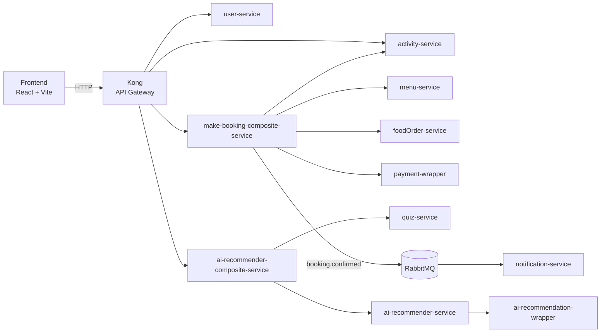

# Art Studio Cafe Booking Microservice

Art Studio Cafe is a microservice-based web platform for discovering creative activities, booking time slots, adding food and drink to a visit, completing payment, and receiving booking confirmations. The project also includes an AI-assisted recommendation flow to help users discover activities that match their preferences.

This repository is designed as a presentation-ready full-stack system with:

- a React frontend
- Kong as the only public API gateway
- multiple FastAPI services and composite services
- RabbitMQ for asynchronous event delivery
- Postgres with database-per-service ownership

## Presentation Summary

This project demonstrates:

- microservice decomposition by business capability
- API gateway routing with Kong
- orchestration through composite services
- asynchronous event-driven communication with RabbitMQ
- service-owned persistence with separate Postgres databases
- frontend-to-backend integration for bookings, payments, saved experiences, and recommendations

At a high level, the user journey is:

1. Browse or discover activities.
2. Choose a valid future booking slot.
3. Add food or drinks to the booking.
4. Submit payment and create the booking.
5. Receive booking confirmation through the notification flow.
6. View and manage bookings from the home page.

## System Architecture

### Public Request Path

```text
Frontend (Vite, localhost:5173)
  -> Kong Gateway (localhost:8000)
    -> user-service
    -> make-booking-composite-service
    -> activity-service
    -> ai-recommender-composite-service
```

### Runtime Roles

- `frontend/app`
  User-facing React application.

- `backend/kong`
  Kong declarative gateway config. This is the only supported public backend entrypoint.

- `backend/composite-service/make-booking-composite-service`
  Orchestrates booking creation, payment, availability checks, food order coordination, and booking persistence.

- `backend/composite-service/ai-recommender-composite-service`
  Coordinates the recommendation flow and routes quiz/recommendation work downstream.

- `backend/services/user-service`
  Authentication and session/profile handling.

- `backend/services/activity-service`
  Activities, bookings, slot availability, booking cancellation, saved activities, and saved experiences.

- `backend/services/menu-service`
  Menu catalog and pricing.

- `backend/services/foodOrder-service`
  Food order persistence.

- `backend/services/quiz-service`
  Quiz question and submission handling.

- `backend/services/notification_service`
  Booking confirmation email delivery.

- `backend/services/ai-recommender-service`
  Recommendation service layer in front of the AI wrapper.

- `backend/wrappers/payment-wrapper`
  Payment integration boundary.

- `backend/wrappers/ai-recommendation-wrapper`
  AI integration boundary.

## High-Level Flow

### Booking Flow

1. The frontend submits booking and payment data to Kong through `POST /booking`.
2. Kong routes the request to `make-booking-composite-service`.
3. The composite validates the selected activity and time slot.
4. The composite validates menu items and creates food-order records.
5. The composite calls the payment wrapper.
6. The composite persists the booking through `activity-service`.
7. A booking confirmation event is published to RabbitMQ.
8. `notification-service` consumes the event and sends the confirmation email.

### Recommendation Flow

1. The frontend interacts with quiz and recommendation endpoints through Kong.
2. Kong routes the request to `ai-recommender-composite-service`.
3. The composite coordinates quiz state and recommendation generation.
4. `ai-recommender-service` and `ai-recommendation-wrapper` handle downstream recommendation work.

### Diagram



## Project Structure

```text
backend/
  docker-compose.yaml
  kong/
    kong.yml
  composite-service/
    ai-recommender-composite-service/
    make-booking-composite-service/
  services/
    activity-service/
    ai-recommender-service/
    calendar-service/
    foodOrder-service/
    menu-service/
    notification_service/
    quiz-service/
    user-service/
  wrappers/
    ai-recommendation-wrapper/
    notification_wrapper/
    payment-wrapper/

frontend/
  app/
```

Notes:

- `calendar-service` exists in the repository but is not part of the current Docker Compose runtime shown in `backend/docker-compose.yaml`.
- `frontend/app/README.md` is the default Vite template README and does not describe the full system. This root README is the project-level reference.

## API Gateway Routes

Kong currently exposes these public route groups:

- `/register`, `/login`, `/profile`, `/logout` -> `user-service`
- `/activities`, `/menu`, `/booking`, `/food-order` -> `make-booking-composite-service`
- `/bookings`, `/saved-activities`, `/saved-experiences`, `/getAllActivities` -> `activity-service`
- `/quiz`, `/recommend` -> `ai-recommender-composite-service`

Kong configuration lives in `backend/kong/kong.yml`.

## Data Ownership

Each stateful service owns its own Postgres database:

- `menu-db`
- `foodorder-db`
- `user-db`
- `activity-db`
- `quiz-db`

Each service stores its own schema and seed files under its `db/init` folder. These scripts run only when a fresh database volume is created.

## Eventing

RabbitMQ is used for asynchronous communication.

Current booking-notification topology:

- Exchange: `booking.events`
- Routing key: `booking.confirmed`
- Queue: `booking.confirmation.email.v2`
- Dead-letter queue: `booking.confirmation.dlq.v2`

Quiz-related messaging uses:

- Exchange: `quiz_events`
- Routing key: `quiz.submitted`

## Local Development Setup

### Prerequisites

- Docker Desktop with Compose support
- Node.js 20+ and npm

### Start Docker Desktop

Docker Desktop must be running before you start the backend.

Quick check:

```bash
docker version
```

### Start the Backend

```bash
cd backend
docker compose up --build
```

Useful variants:

```bash
docker compose up -d --build
docker compose down
docker compose down -v
```

Use `docker compose down -v` only when you intentionally want to remove persisted database state and re-run initialization from scratch.

### Start the Frontend

```bash
cd frontend/app
npm install
npm run dev
```

### Local URLs

- Frontend: `http://localhost:5173`
- Kong gateway: `http://localhost:8000`
- Kong admin API: `http://localhost:8001`

## Ports

Developer-facing ports used in the current stack:

- `5173` frontend dev server
- `8000` Kong proxy
- `8001` Kong admin API
- `8005` user-service
- `8007` payment-wrapper
- `8010` notification-service
- `8011` activity-service
- `8012` quiz-service
- `8013` menu-service
- `8014` foodOrder-service
- `8015` ai-recommender-service
- `5433` menu-db
- `5434` foodorder-db
- `5435` user-db
- `5436` activity-db
- `5437` quiz-db
- `5672` RabbitMQ AMQP
- `15672` RabbitMQ management UI

## Environment and Secrets

This project uses a mix of Compose-managed variables and service-specific env files.

Examples:

- `payment-wrapper` uses its own `.env`
- `ai-recommendation-wrapper` uses its own `.env`
- `notification-service` reads Resend-related values through Compose environment variables
- database-backed services receive `DATABASE_URL` through Compose

Relevant email variables:

- `RESEND_API_KEY`
- `RESEND_FROM_EMAIL`
- `RESEND_TEST_RECIPIENT`
- `RESEND_FORCE_TEST_RECIPIENT`

## Troubleshooting

### Docker Desktop Pipe Error

If you see an error like:

```text
open //./pipe/dockerDesktopLinuxEngine: The system cannot find the file specified
```

Docker Desktop is not running or its Linux engine is unavailable.

Useful checks:

```bash
docker version
docker context ls
```

On Windows:

```powershell
Get-Service com.docker.service
```

### Login Returns 404

If login returns 404 from the frontend, first verify Kong and the backend stack are running.

Useful checks:

```bash
curl http://localhost:8000/profile
curl -X POST http://localhost:8000/login
```

### Booking Cancel Route Returns 404

If `/bookings/{id}/cancel` returns 404 after backend route changes, rebuild the affected services:

```bash
cd backend
docker compose up -d --build activity-service kong
```

### Source Code Changed but Containers Still Serve Old Behavior

Rebuild the affected services:

```bash
docker compose up -d --build <service-name>
```

## Key Design Notes

- Kong is the only supported public API entrypoint.
- Activity availability is derived from persisted bookings in `activity-service`.
- Booking confirmation email delivery is asynchronous.
- Booking history and booking cancellation are exposed through `activity-service` via Kong.
- Payment happens before final booking persistence in the booking composite flow.
- Frontend issues should generally be debugged by following the path: frontend -> Kong -> downstream service.